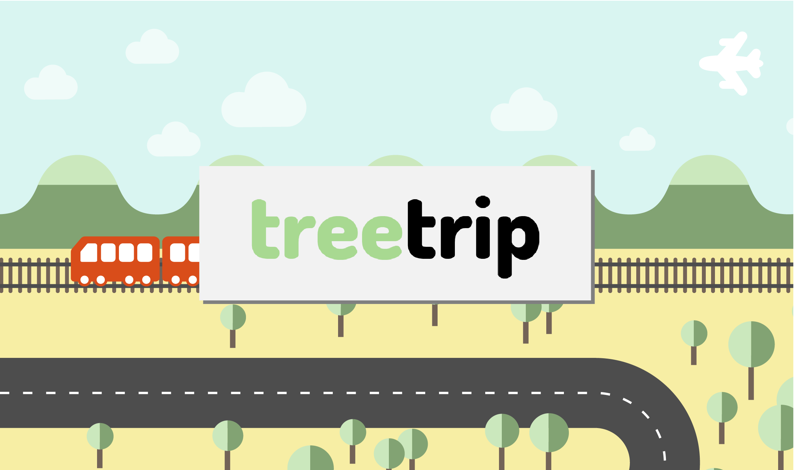
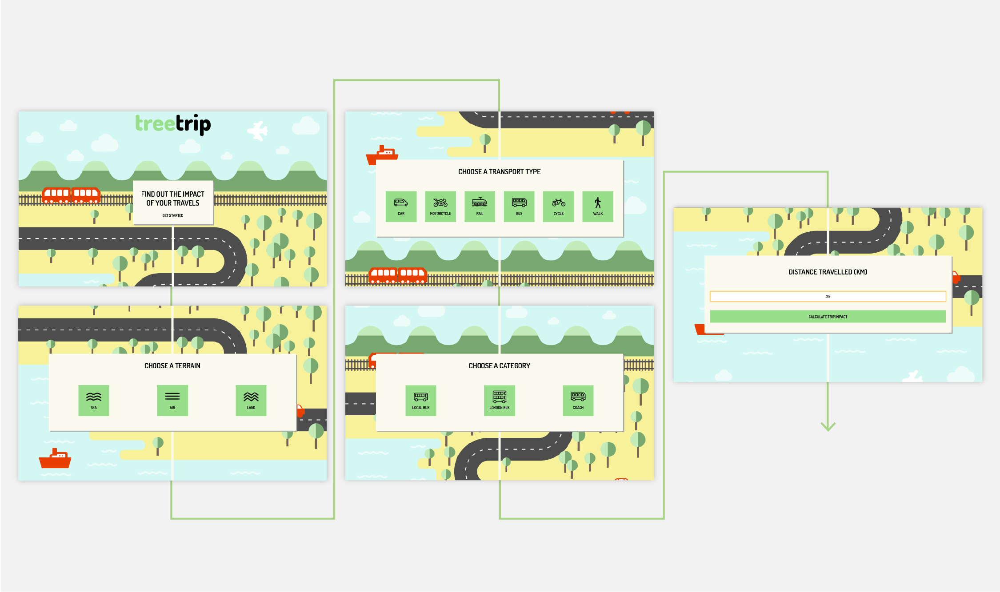
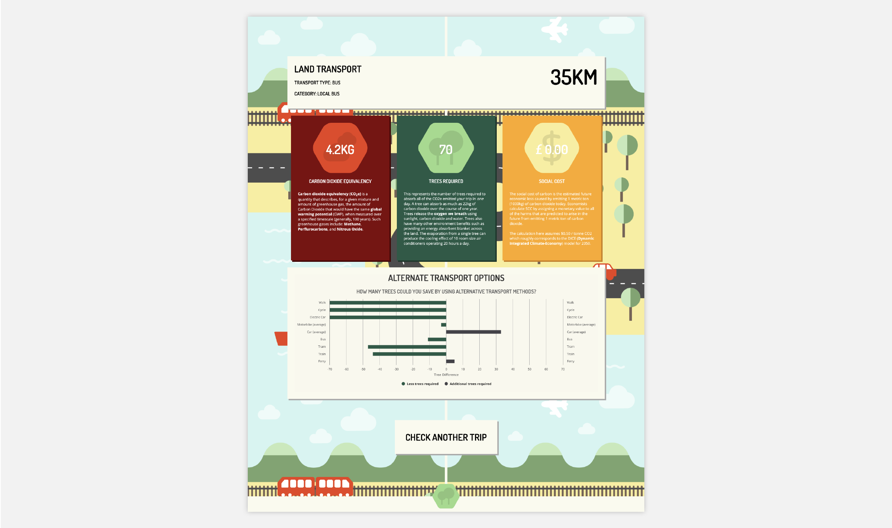

# CodeClan Week 9 Group Project
**[Alasdair Carstairs](https://github.com/Alasdair321), [Eric Cross](https://github.com/ericxcross), [Myriam Boran](https://github.com/MyriamBoran)**

## TreeTrip Javascript Project

Find out the number of trees required to absorb the released CO2 from your trip by selecting from the transport categories and providing the distance travelled.

## Demo the App on **[Heroku](https://treetrip-co2e.herokuapp.com/)**





## Running the website locally:

Install dependencies:

```
npm install
```

Run webpack:

```
npm run build
```

### Using

The application is running on port 300 so visit http://localhost:3000.
